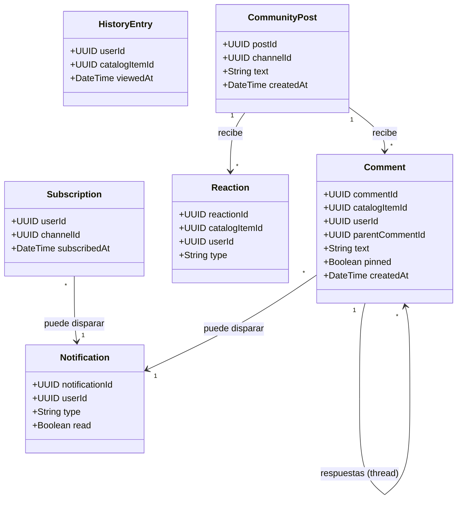
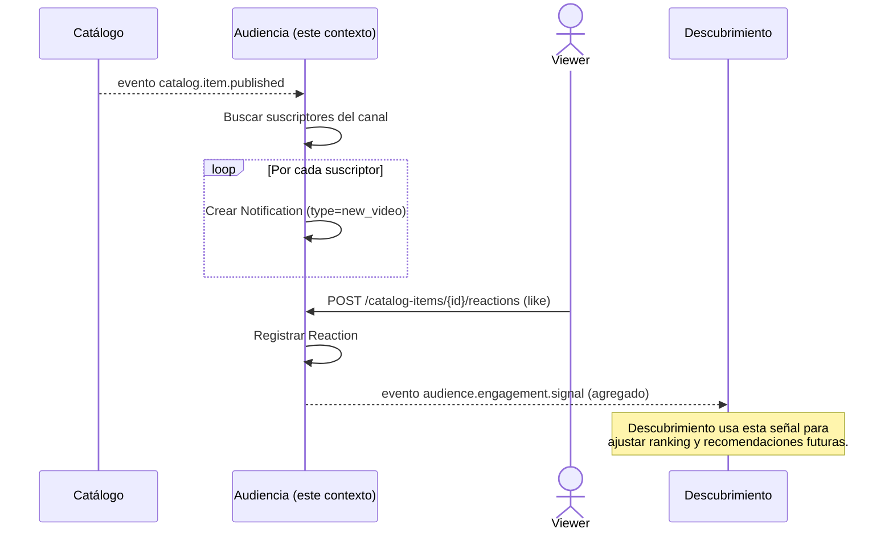

# Diagramas — Audiencia, comunidad y engagement

## Diagrama de clases (conceptual)

**Notas de diseño:**
- `Comment` se auto-referencia con `parentCommentId` para modelar threads
  (RF-A3), en vez de tener una clase separada `Reply`.
- Ninguna de estas clases guarda metadata editorial del video ni del
  canal — solo `catalogItemId`/`channelId` como referencia, validando su
  existencia contra Catálogo cuando haga falta, tal como exige la
  restricción de diseño del contexto.
- `Subscription` es deliberadamente simple (sin precio, sin nivel): la
  versión "de pago" (membresías) es una clase completamente distinta que
  vive en Monetización.

## Diagrama de secuencia — "Publicación dispara notificación + reacción genera señal"

Cubre dos integraciones clave: consumir el evento de Catálogo para
notificar suscriptores, y emitir una señal de engagement consumida por
Descubrimiento (paso 5 del escenario integrador: "Registrar like →
Audiencia").

**Por qué este flujo valida bien la frontera entre contextos:** Audiencia
reacciona a que algo se publicó (Catálogo) generando notificaciones, y
produce señales de interacción, pero nunca decide qué se recomienda
después (eso es responsabilidad exclusiva de Descubrimiento) ni almacena
metadata editorial — solo enriquece la relación social alrededor del
contenido.
