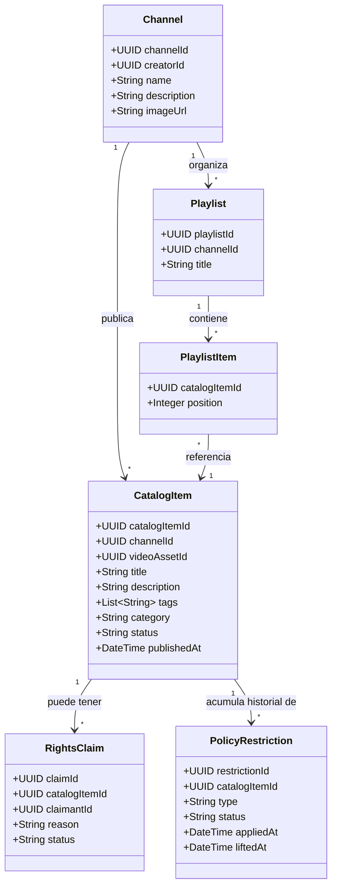
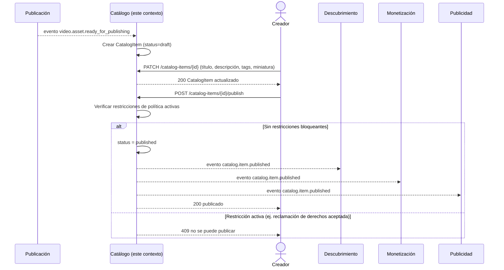

# Diagramas — Catálogo editorial y derechos

## Diagrama de clases (conceptual)

**Notas de diseño:**
- `CatalogItem.videoAssetId` es solo una **referencia** (un UUID) al
  `VideoAsset` que vive en el contexto de Publicación. No se copian sus
  campos técnicos (renditions, duración, status de procesamiento) — eso
  rompería el principio de modelo propio por contexto.
- `PolicyRestriction` se modela como historial (puede haber varias en el
  tiempo, activas o levantadas), no como un único campo de estado, porque
  RF-C6 pide explícitamente mantener historial de política.

## Diagrama de secuencia — "Desde asset técnico listo hasta contenido publicado"

Este flujo conecta el evento de salida del Contexto 1 (Publicación) con la
publicación editorial, y muestra cómo Catálogo notifica a los demás
contextos al publicar.

**Por qué este flujo valida bien la frontera entre contextos:** Catálogo
es el único que decide *si* algo es publicable (revisa sus propias
restricciones), pero no le dice a Descubrimiento *cómo* rankear el
contenido, ni a Monetización *cuánto* pagar — solo notifica el cambio de
estado vía evento y cada contexto decide qué hacer con esa información
(RNF-4: preferir eventos asíncronos, evitar acoplamiento).
