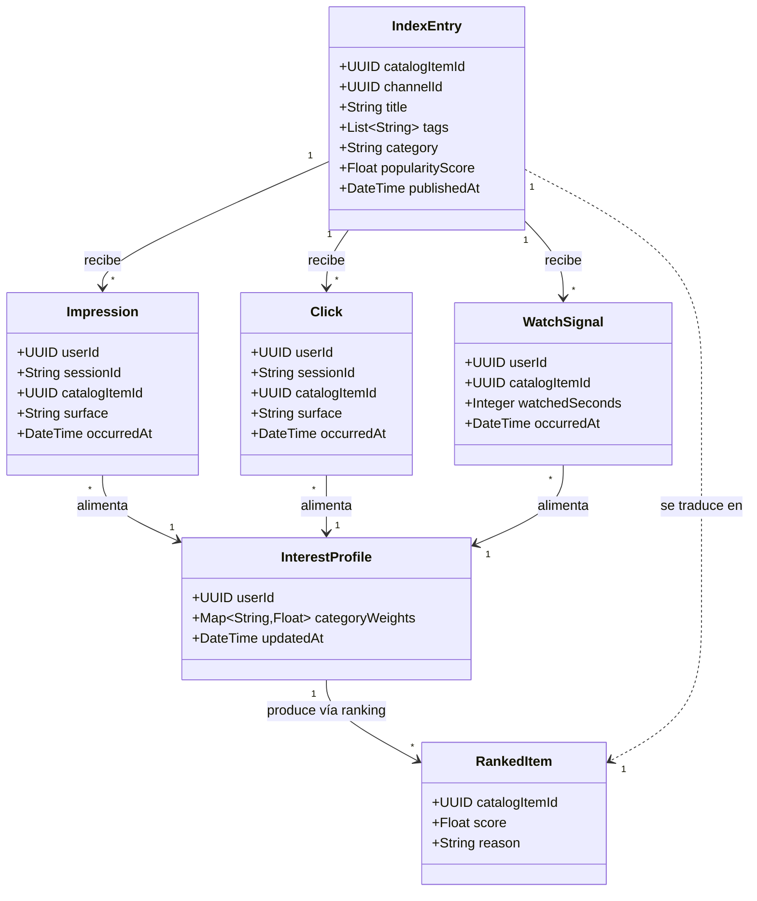
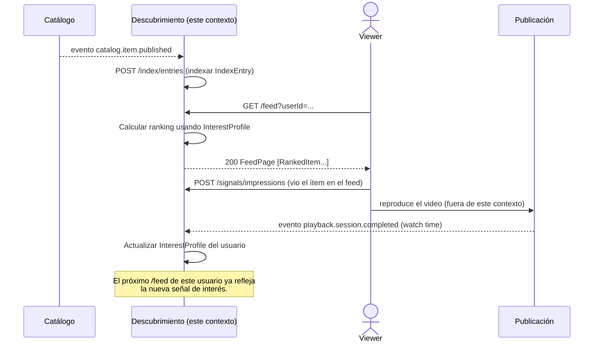

# Diagramas — Descubrimiento y personalización

## Diagrama de clases (conceptual)

**Notas de diseño:**
- `IndexEntry` es la representación propia de este contexto del concepto
  "video" — liviana y orientada a ranking, distinta de `CatalogItem`
  (Catálogo) y de `VideoAsset` (Publicación). No duplica metadata
  completa: solo lo necesario para buscar/rankear (título, tags,
  categoría, popularidad).
- `RankedItem` es lo que efectivamente devuelven las APIs (search, feed,
  related, trending): una referencia + score + razón, nunca el contenido
  completo.

## Diagrama de secuencia — "Indexación + recomendación + captura de señal"

Muestra cómo este contexto consume el evento de publicación de Catálogo
para construir su índice, y cómo registra señales que alimentan futuras
recomendaciones — cerrando el ciclo de personalización.

**Por qué este flujo valida bien la frontera entre contextos:**
Descubrimiento nunca decide si el contenido es visible (eso ya lo filtró
Catálogo antes de emitir el evento de publicación) ni almacena el stream
(eso es de Publicación) ni guarda comentarios o likes (eso es de
Audiencia) — solo indexa referencias y aprende patrones de interés a
partir de señales que otros contextos le notifican.
