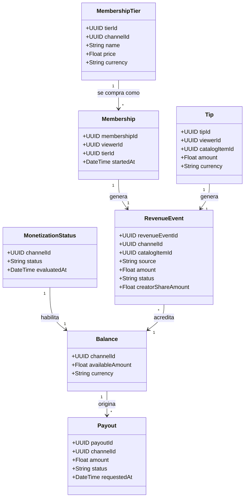
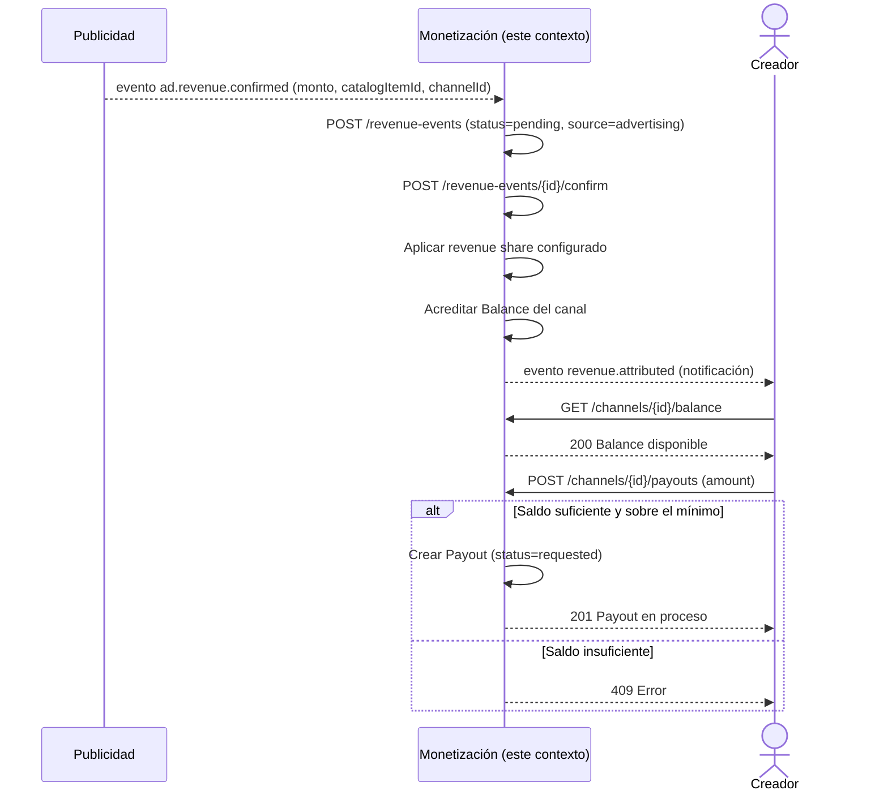

# Diagramas — Monetización del ecosistema creador

## Diagrama de clases (conceptual)

**Notas de diseño:**
- `RevenueEvent` es la clase central: unifica publicidad, membresías y
  propinas bajo un mismo concepto de "ingreso a repartir", con un campo
  `source` que distingue el origen. Esto evita tener tres tablas de
  ingreso paralelas con lógica de reparto duplicada.
- `RevenueEvent` no almacena los datos de la campaña publicitaria ni del
  anunciante — eso vive en Publicidad. Solo llega el monto ya calculado
  vía `externalReference`, manteniendo la frontera entre "cuánto pagó el
  anunciante" (Publicidad) y "cuánto le toca al creador" (Monetización).
- `Balance` es un acumulado derivado de `RevenueEvent` confirmados, no
  una clase que se edita directamente — solo cambia vía eventos de
  ingreso confirmados o pagos procesados.

## Diagrama de secuencia — "Del ingreso publicitario al pago al creador"

Este es el tramo final del escenario integrador completo (reproducción →
like → watch time → **atribución de ingresos**), mostrando cómo este
contexto consume el ingreso ya confirmado por Publicidad y lo convierte
en saldo disponible para retiro.

**Por qué este flujo valida bien la frontera entre contextos:**
Monetización confía en el monto que le entrega Publicidad (no
recalcula impresiones ni precios de subasta — eso sería invadir el
contexto de Publicidad) y se limita a aplicar las reglas de reparto y
gestionar el ciclo de vida del dinero del creador (saldo → retiro →
pago), que es exactamente su responsabilidad según RF-M3 a RF-M5.
