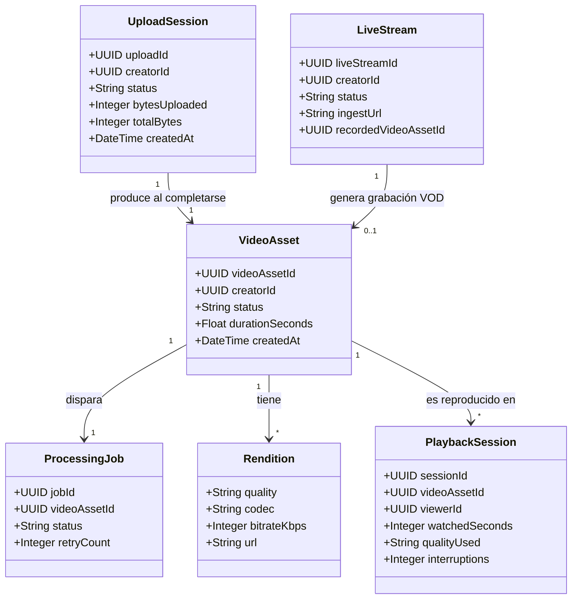
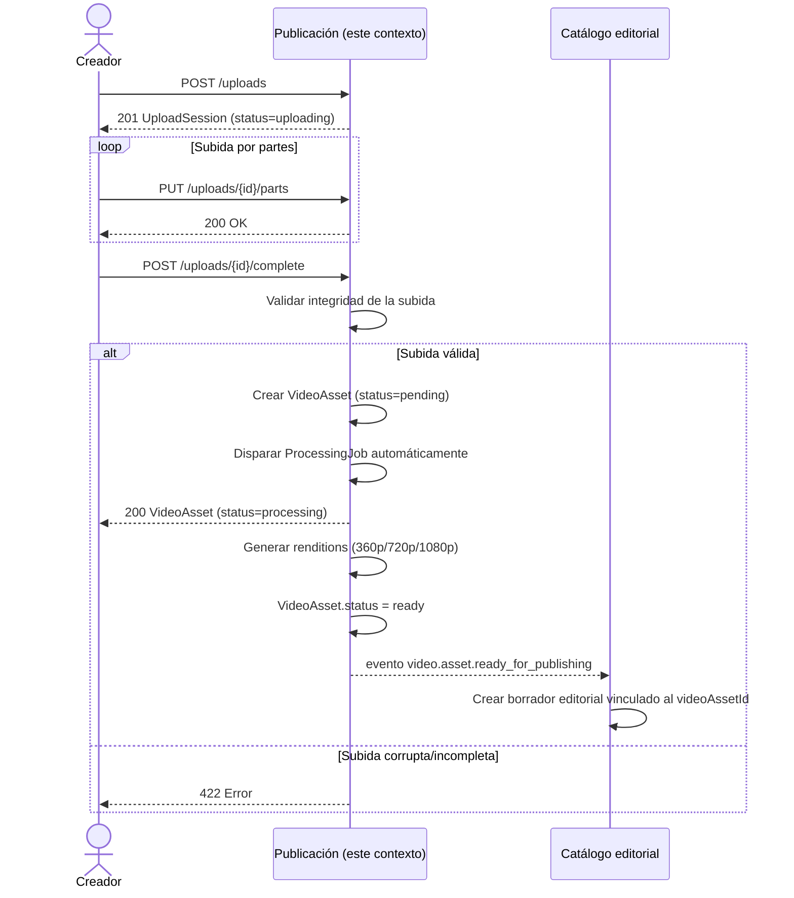

# Diagramas — Publicación y distribución de contenido

GitHub renderiza estos bloques ```mermaid``` automáticamente como diagramas
al ver este archivo en el repositorio (no hace falta exportar imágenes).

## Diagrama de clases (conceptual)



**Notas de diseño:**
- `VideoAsset` aquí es el *archivo/stream técnico*, sin título ni descripción
  (eso vive en `CatalogItem` dentro del contexto de Catálogo — es un modelo
  distinto, no la misma clase compartida).
- `LiveStream` y `UploadSession` son ambos *productores* de `VideoAsset`,
  pero por caminos distintos (subida directa vs. grabación de un live).

## Diagrama de secuencia — "Un creador sube un video hasta que queda listo para publicar"

Este es el flujo end-to-end de RF-P1 → RF-P2, mostrando además la
integración con el contexto de Catálogo (consume el evento que este
contexto emite).



**Por qué este flujo valida bien la frontera entre contextos:** Publicación
nunca decide si el contenido es público ni le pone título — solo avisa
"técnicamente está listo". Es Catálogo quien decide qué hacer con esa
notificación (crear un borrador, esperar a que el creador complete
metadata, etc.). Si Publicación intentara también publicar el contenido,
estaríamos mezclando dos responsabilidades de negocio distintas — justo
lo que la "regla del proyecto" del enunciado dice que hay que evitar.
