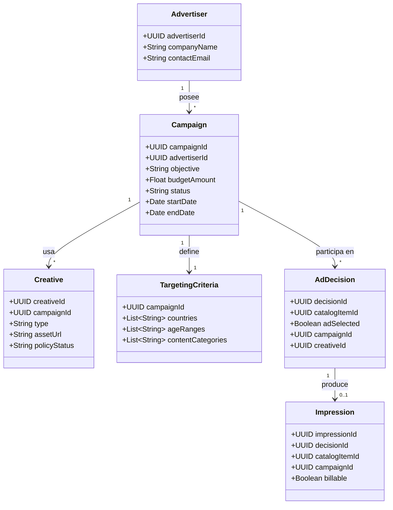
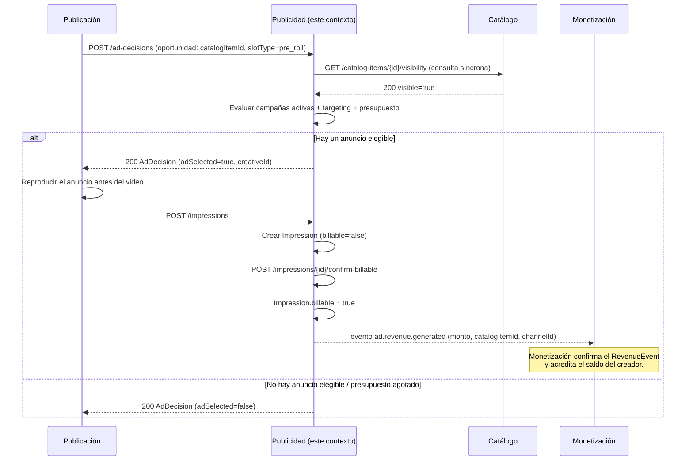

# Diagramas — Publicidad y marketplace de anunciantes

## Diagrama de clases (conceptual)

**Notas de diseño:**
- `AdDecision` modela explícitamente el resultado de "evaluar una
  oportunidad de visualización", incluyendo el caso `adSelected=false`
  (no mostrar nada) — RF-F6 lo pide expresamente.
- Ninguna clase aquí contiene metadata editorial del video (eso es
  Catálogo) ni datos del creador o su saldo (eso es Monetización):
  `catalogItemId` es solo una referencia para targeting/elegibilidad.
- `Impression.billable` distingue entre "se sirvió" y "cuenta para
  facturación", porque RF-F7 separa medición bruta de gasto real.

## Diagrama de secuencia — "Elegir anuncio → impresión facturable → ingreso para el creador"

Cubre el paso 3 del escenario integrador ("Elegir anuncio → Publicidad")
y su conexión con el paso 7 ("Atribuir ingreso al creador →
Monetización"), cerrando el ciclo completo del proyecto.

**Por qué este flujo valida bien la frontera entre contextos:**
Publicidad consulta a Catálogo solo para confirmar visibilidad (consulta
síncrona, permitida por RNF-4), pero nunca decide publicar ni
despublicar nada. Y aunque Publicidad es quien cobra al anunciante,
**no paga directamente al creador** — solo emite un evento de ingreso
generado; es Monetización quien decide cómo repartirlo. Esto evita
exactamente el error típico listado en el enunciado: "Payouts en
Publicidad".
