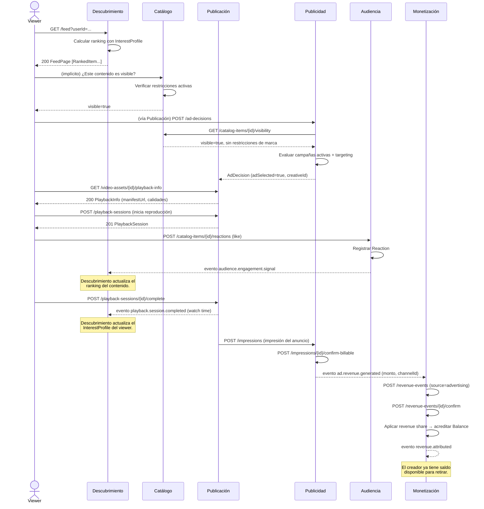

# Escenario Integrador — Flujo de punta a punta

Este diagrama muestra cómo interactúan los 6 bounded contexts en el
escenario completo: desde que un viewer recibe una recomendación hasta
que el creador recibe el ingreso publicitario correspondiente.

## Diagrama de secuencia UML

## Resumen de responsabilidades por paso

| Paso | Contexto | Acción |
|------|----------|--------|
| 1 | Descubrimiento | Genera el feed personalizado usando el InterestProfile del viewer |
| 2 | Catálogo | Valida que el contenido es visible (sin restricciones activas) |
| 3 | Publicidad | Decide qué anuncio mostrar según campañas activas y targeting |
| 4 | Publicación | Entrega el stream técnico al viewer y registra la sesión |
| 5 | Audiencia | Registra el like y emite señal de engagement a Descubrimiento |
| 6 | Publicación | Registra el watch time y lo notifica a Descubrimiento |
| 7 | Publicidad | Confirma la impresión como facturable y notifica el ingreso a Monetización |
| 8 | Monetización | Aplica el revenue share y acredita el saldo del creador |

## Eventos de integración entre contextos

| Evento | Emisor | Consumidor | Propósito |
|--------|--------|------------|-----------|
| `video.asset.ready_for_publishing` | Publicación | Catálogo | Avisar que el asset técnico está listo |
| `catalog.item.published` | Catálogo | Descubrimiento, Audiencia, Monetización, Publicidad | Avisar que el contenido es público |
| `catalog.item.unpublished` | Catálogo | Descubrimiento, Publicidad | Remover del índice y detener anuncios |
| `playback.session.completed` | Publicación | Descubrimiento | Señal de watch time para ranking |
| `audience.engagement.signal` | Audiencia | Descubrimiento | Señal de likes/reacciones para ranking |
| `audience.user.subscribed` | Audiencia | Audiencia (notificaciones) | Disparar notificaciones de nuevo contenido |
| `ad.revenue.generated` | Publicidad | Monetización | Transferir ingreso publicitario confirmado |
| `revenue.attributed` | Monetización | — | El creador tiene saldo disponible |
| `campaign.budget.exhausted` | Publicidad | Publicidad | Pausar entrega de anuncios de esa campaña |
